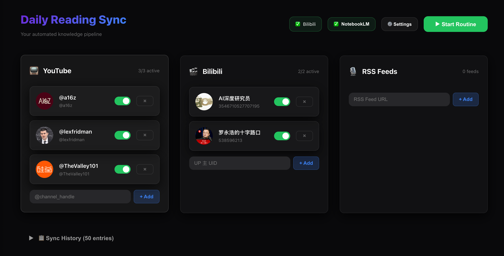

# DailyReading
[简体中文](./README_zh.md)

A smart reading assistant that integrates multi-source scraping and AI automated synchronization. It automatically filters content from YouTube, Bilibili, and RSS feeds, extracts subtitles/transcripts, and syncs to Google NotebookLM for generating daily reading summaries.



## ✨ Features

- **Multi-source Content Scraping**
  - YouTube channels (via RSS feeds)
  - Bilibili UP主 (via WBI API)
  - RSS feeds
  
- **Subtitle/Transcript Extraction**
  - Bilibili: Auto-extracts Chinese subtitles via HTTP API + SESSDATA authentication
  - YouTube: Native transcript support
  
- **Smart Source Management**
  - Visual dashboard with channel avatars and names
  - Toggle switches to enable/disable individual sources
  - Auto-caching of channel info (name, avatar)

- **NotebookLM Integration**
  - Automated sync via Playwright
  - Direct links to generated notebooks

## 🛠 Tech Stack

- **Framework**: [Next.js](https://nextjs.org/) (App Router)
- **Scraping**: 100% HTTP-based for YouTube and Bilibili (no browser needed)
- **Automation**: [Playwright](https://playwright.dev/) for NotebookLM sync only
- **Real-time Updates**: Server-Sent Events (SSE) for task progress

## 🚀 Quick Start

### 1. Installation

```bash
npm install
npx playwright install chromium
npm run dev
```

Access [http://localhost:3000](http://localhost:3000) to open the dashboard.

### 2. Configuration

1. **Add Sources**: Add YouTube handles (`@channel`) and Bilibili UIDs in the dashboard
2. **Bilibili SESSDATA**: Add your SESSDATA in Settings for subtitle extraction (required for Bilibili)
3. **Chrome Path**: Set your Chrome executable path for NotebookLM sync
4. **NotebookLM Auth**: Click the NotebookLM button to authorize

### 3. Run Sync

Click **"Start Routine"** to:
1. Scrape latest videos from all enabled sources
2. Extract Bilibili subtitles (if SESSDATA configured)
3. Sync content to NotebookLM

## 📂 Project Structure

```
src/
├── app/              # Dashboard UI & API routes
├── lib/
│   ├── scrapers/     # Platform scrapers (YouTube, Bilibili, RSS)
│   ├── coordinator.ts # Scraping orchestration
│   ├── main.ts       # Daily routine logic
│   └── notebooklm.ts # NotebookLM automation
```

## 🔧 How Bilibili Subtitle Extraction Works

1. Uses WBI API to fetch video lists (no browser needed)
2. Authenticates with SESSDATA cookie for subtitle access
3. Downloads and formats Chinese subtitles
4. Syncs formatted content to NotebookLM

## 🖥 Cross-platform Notes

- **macOS**: Use LaunchAgents with the `.plist` in `deploy/` for scheduling
- **Windows**: Use Task Scheduler for automated runs
- **Chrome Path Examples**:
  - Mac: `/Applications/Google Chrome.app/Contents/MacOS/Google Chrome`
  - Windows: `C:\Program Files\Google\Chrome\Application\chrome.exe`

## 🌐 API Integration (Beta)

You can trigger the daily sync routine programmatically via the API, for example from **OpenClaw** or **Cron**.

### Trigger Sync

- **Endpoint**: `POST /api/trigger`
- **Description**: Starts the daily routine (scrape -> extract -> sync to NotebookLM). The browser will close automatically after completion.
- **Timeout**: The process may take **1-5 minutes** depending on content volume. Ensure your client timeout is set accordingly.

#### Response Example (Success)

```json
{
  "status": "success",
  "message": "Successfully synced 5 items",
  "scrapedItems": [
    { "title": "New Video 1", "url": "https://...", "source": "Bilibili" }
  ],
  "notebookUrl": "https://notebooklm.google.com/notebook/..."
}
```

#### Response Example (No Content)

```json
{
  "status": "no_content",
  "message": "No new content found",
  "scrapedItems": []
}
```

#### Error Response

Returns status `500` or `429` (if already running).

```json
{
  "status": "failed",
  "message": "Error message details",
  "error": "Full error stack..."
}
```

---

*Note: This project is for personal productivity. Please comply with each platform's terms of use.*
